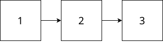

# SCL

## Standard Collections Library for JavaScript/TypeScript

Sam Vervaeck

---

# About Me

 - Started coding in my teens
 - Some computer science
 - Started Accelera
 - Now full time open source developer

---

# Notable projects

- The Bolt Programming Language
  https://github.com/boltlang/bolt
- The Mage Parser Generator
  https://github.com/samvv/mage

---

## What is a collection?

---

```ts
/**
 * Base interface for any data structure that contains multiple elements.
 *
 * @typeParam T The type of element in the collection.
 */
export interface Collection<T> {

  /**
   * Add an element to the collection. If the element already exists, update its
   * value.
   *
   * The location where the element is placed depends on the collection type,
   * and in the generic case there is no guarantee on the location where it is
   * inserted.
   *
   * This method returns a pair with the first element indicating whether the
   * element was added, while the second element refers to the actual location
   * of the element.
   *
   * @param hint A transparent object obtained by {@link getAddHint}.
   */
  add(element: T, hint?: any): AddResult<T>;

```

---

```ts
  /**
   * Count the amount of elements in the collection.
   *
   * ⚠️ In most cases, this should be an `O(1)` operation. However, there are
   * cases where this can be an `O(n)` operation. Therefore, it is recommended
   * to always cache the result in a local variable.
   */
  readonly size: number

```

---

```ts
  /**
   * Checks if the collection holds the given element.
   *
   * @param element The element to check membership of.
   * @return True if the collections holds the given element, false otherwise.
   */
  has(element: T): boolean

  /**
   * Returns an object which is able to sift through the values in this collection.
   *
   * The order by which the elements are traversed depends on the kind of collection.
   * For unordered collections, the iteration order is unspecified and may even differ
   * between two iterations on the same collection.
   */
  [Symbol.iterator](): IterableIterator<T>
```

---

```ts
  /**
   * Remove the element pointed to by the iterator result from this collection.
   */
  deleteAt(position: Cursor<T>): void;

  /**
   * Remove an element from the collection. If multiple elements are matched,
   * the collection picks one of them.
   *
   * @return `true` if the element was found, `false` otherwise.
   */
  delete(element: T): boolean;

  /**
   * Remove an element from the collection. If multiple elements are matched,
   * the collection removes all of them.
   *
   * @return The amount of elements that was removed.
   */
  deleteAll(element: T): number;

}
```

---

# CRUD

---

# Not the full definition!

Check the docs for the full specification

https://samvv.github.io/scl.js/interfaces/Collection.html

---

 - `Sequence<T>` for when the order of the elements is defined by the interactions of the end-user
 - `Bag<T>` is like `Sequence<T>` but it is **never** guaranteed in what order the elements are stored
 - `Index<T, K>` for quick access to a certain sub-component K of the element
 - `SortedIndex<T, K>` is an ordered index where we can e.g. take the largest element or the smallest.
 - `Dict<K, V>` for when key and value are separate entities

---

# Sequences

 - DoubleLinkedList
 - SingleLinkedList

---



---

| Operation   | Complexity |
|-------------|------------|
| `first()`   | O(1)       |
| `last()`    | **O(n)**       |
| `prepend()` | O(1)       |
| `size`      | O(1)       |
| `insert()`  | **O(n)**       |
| `append()`  | **O(n)**       |

---


---

| Operation   | Complexity |
|-------------|------------|
| `first()`   | O(1)       |
| `last()`    | O(1)       |
| `prepend()` | O(1)       |
| `size`      | O(1)       |
| `insert()`  | O(1)       |
| `append()`  | O(1)       |

... but DoubleLinkedList takes a little bit more memory and bookkeeping

---

# Random Access Data Structures

 - HashIndex
 - Vector

---

# Tree-based Data Structures

 - AVLTreeIndex
 - RBTreeIndex
---


 ---


---


---

AVLTreeIndex = slightly better optimised for lookups

RBTreeIndex = good all-rounder

---

# Dict and MultiDict

Thin wrappers around an Index

_In reality they are `Index<[K, V], V>`_

 - RBTreeDict
 - RBTreeMultiDict
 - HashDict
 - HashMultiDict
 - TreeDict is an alias for RBTreeDict

---

# Bonus Content

---

```cpp
struct employee
{
  int         id;
  std::string name;
  int         age;
};

// define a multiply indexed list
typedef multi_index_container<
  employee,
  indexed_by<
    sequenced<>,
    hashed_non_unique<member<employee,std::string,&employee::name> >
    ordered_non_unique<member<employee,int,&employee::age> >
  > 
> employee_lsit;
```

---

```ts
interface Employee {
  id: number;
  name: string;
  age: number;
}
```

---

```ts
import { types, ValueOf } from "reflect-types"

const employeeType = types.object({
  id: types.number().primary(), // `primary` means use this as key
  name: types.string(),
  age: types.number(),
});
```

---

```ts
import { collection } from "scl.js"

const elements = collection(employeeType)
  .sequenced("main") // Main index
  .randomAccess("byName") // Hash index for 'name' property
  .key("byName", "name")
  .ordered("byAge") // Tree index for 'age' property
  .key("byAge", "age")
  .optimiseLookup("byAge")
  .build(); // Return a fresh collection
```

All of this is fully typed

---

```ts
// Just works
elements.add({ id: 1, name: 'James Smith', age: 33 });

// Find the oldest person younger than 20 in 'byAge' index
persons.getIndex("byAge").getGreatestLowerBound(20)

// throws an error at compile time
persons.getIndex("doesNotExist") 
```

---

# Contributions welcome!

